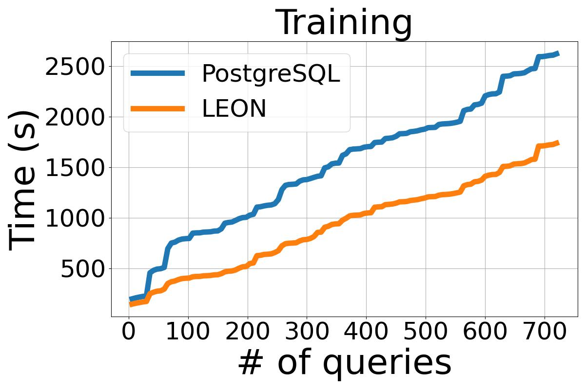

# LEON: ML-Aided Query Optimizer

<!-- <div style="text-align:center">
  
</div> -->
<p align="center">
  
<p>


LEON is a ML-based framework that **aids** the an expert cost-based query optimizer. LEON digs into the entire dynamic programming plan space, meticulously exploring various permutations and combinations of query execution plans. Remarkably, its deep dive into this expansive space doesn't perturb the quest for the global optimum solution.

Due to the absence of native hook functions for interfacing, this repository facilitates the integration of AI and database systems by modifying the PostgreSQL-14.5 source code. This enables the seamless operation of LEON within the database environment but also paves the way for a more intelligent and efficient query optimization process. 

This is Pytorch implementation of the paper: [LEON: A New Framework for ML-Aided Query Optimization](https://www.vldb.org/pvldb/vol16/p2261-chen.pdf). For technique details, please refer to the paper.


## Setup

**1. PostgreSQL**

First clone the repository to your local machine and install modified PostgreSQL from source code (in [`setup_pg.sh`](./LEON/setup_pg.sh)). 

```bash
# 1. download repository
git clone git@github.com:Thisislegit/LeonProject.git

# 2. install modified PostgreSQL-14.5 and install pg_prewarm
./configure --prefix=～/pg_install/
make -j && make install
cd ./contrib/pg_prewarm
make && make install
cd ../../

# 3. use the correct configuration (after initialization).
cp ./LEON/conf/LEON-postgresql.conf ～/pg_install/MyData/postgresql.conf
```

**2. Load Dataset**

You can refer to [`Balsa`](https://github.com/balsa-project/balsa/) for detailed explaination. 


After loading the dataset, you can optionally use [`prewarm.py`](./LEON/conf/pre_warm.py) script for stable performance (We use join-order-benchmark as an example).
```bash
python ./LEON/conf/pre_warm.py
```

**3. Python Enviroment**
```bash
# install conda environment
cd LeonProject/LEON
conda env create -f environment.yml
```

## Integrate LEON into PostgreSQL

We use several GUC in the clients of PostgreSQL (e.g., psql) to control the behavior of PostgreSQL and make it connect to ML models. 

**Note** the integration realize following functionality:

- [x] Utilizes ML models or any cost estimation method to select any execution plan or sub-plan in SPJ (Select-Project-Join) queries.

- [x] Sends detailed execution information about the execution plan (operators, cost, cardinality, etc.) from the PostgreSQL end to the Python server.

- [x] The Python server sends back signals (estimated costs) to interfere with and guide the decision-making process of the PostgreSQL optimizer.

### GUC

1. **enable_leon** (enable_leon is off as default.)
    
    It enables LEON functionality. If it is off, PostgreSQL will fallback to the traditional performance.

2. **not_cali**  (not_cali is off as default.)

    Off means enable cost calibration: 
    
        FinalCost =  ModdelPrediction * PG cost model. 
    
    Otherwise, it uses ML model prediction as cost.

3. **leon_port** and **leon_host**  (leon_port=9999, leon_host='localhost' as default)

    They are used to connect with ML model server.

4. **free_size** (free_size = 50 as default.)

    We explore a fixed number of plan space in every single equivalent set. Experimentally, you can set it to a large value that allows ML model to interference to every subplan.

5. **leon_query_name** (leon_query_name = '' as default)

    This is a tag to the running query, which is used in our interal logic related to collect potential plan space, picking the plan that we want at any level (similar to [`pg_hint_plan`](https://github.com/ossc-db/pg_hint_plan)).

## Quick Start

There are two main files that implement LEON's functionality: `leon_server.py` and `leon_trainer.py`. 

1. `leon_server.py`: This Python script acts as the server component of LEON. It receives execution plan details (operators, cost, cardinality, etc.) from the PostgreSQL database, applies the ML model to evaluate or interfere with the query optimization process based on learned strategies.

2. `leon_trainer.py`: This script is responsible for training the ML models used by LEON. It takes historical query execution data as input, including execution plans, their performance metrics, and other relevant information, to train models that can predict the calibration cost of different execution plans. The trained models are then used by the leon_server to provide real-time decision support for query optimization in PostgreSQL.


**Note**: To facilitate data collection, we use multiple PostgreSQL as executor. For details, please refer to [Multiple Executors](#multiple-executors).

To start the experiment, run the following command.
```bash
cd ./LEON

# This will restart start multiple PostgreSQL (optional), prewarm them (optional) and start the leon_server
bash run.sh 
```

This takes about 10 seconds, you can see message like 

```
... Connected to Ray cluster
Read Workload: job_training
Init LeonModel Finish 
... Connected to Ray cluster
Read Workload: job_training
Init SimpleLeonModel Finish
```
After that you can run queries on PostgreSQL client psql or run our training script:
```bash
# Start the trainer
python leon_trainer.py
```


## Detail Configurations

We have a several enhancement over the orignal paper and introduce some new concepts such as **affection space** in this implementation. Please refer to The [`LeonNotes`](LEON/LeonNotes.md) for details. 

The [`Configuration File`](LEON/conf/leon.cfg) for LEON contains a comprehensive list of parameters that can be adjusted to tailor the framework to your specific needs.

In the following section, we underscore several detail configurations.


### Multiple Executors
To facilitate data collection, we use multiple PostgreSQL instances as executors. It is important to note that running several instances on the same local machine will have **high memory requirements**. To manage this efficiently, it's essential to ensure that the machine has sufficient resources to avoid performance degradation or system instability.

1. Instance Configuration: data directory and port management

     Create a separate data directory for each PostgreSQL instance. 
     This can be done by copying the original data directory to new locations. Each directory will act as the data storage for one instance of PostgreSQL. Then change the postgresql port to other ports, this should be aligning with `other_db_port` configuration file.

2. Start Multiple Instances:

    ```bash
    # data2 and data3 are copy of data1
    pg_ctl -D ~/pg_install/data1 start
    pg_ctl -D ~/pg_install/data2 start
    pg_ctl -D ~/pg_install/data3 start
    ```

### Trainer

We mainly use two ML model i.e., DNN model and a TreeConv Model (defined in folder [LEON/models/](LEON/models/)), to to aid traditional cost model. We train two models in a pairwise ranking method, which is proven to be accurate than a regression model.

### Data Collection

During query optimization, we asynchronously log all statistical information of execution plan/subplans, ensuring this process does not interfere with the normal planning. The plans and subplans are written to files located in `./log/messages.pkl`. To facilitate organization and retrieval, plans associated with the same equivalent sets are grouped together.

## Reproduce
To reproduce on `job_training` dataset, load the ckpt in `models`

```python
model, dnn_model = load_model(model_path, queryFeaturizer, nodeFeaturizer, ckpt=True)
```


<p align="center">
  
<p>

## Citation
If you find this repository useful in your research, please at least cite the following paper and the source code:


- Xu Chen, Haitian Chen, Zibo Liang, Shuncheng Liu, Jinghong Wang, Kai Zeng, Han Su, Kai Zheng*: [LEON: A New Framework for ML-Aided Query Optimization](https://www.vldb.org/pvldb/vol16/p2261-chen.pdf). VLDB 2023


```
@article{chen2023leon,
  title={Leon: A new framework for ml-aided query optimization},
  author={Chen, Xu and Chen, Haitian and Liang, Zibo and Liu, Shuncheng and Wang, Jinghong and Zeng, Kai and Su, Han and Zheng, Kai},
  journal={Proceedings of the VLDB Endowment},
  volume={16},
  number={9},
  pages={2261--2273},
  year={2023},
  publisher={VLDB Endowment}
}
```

```
@misc{leon_github,
  howpublished = {\url{https://github.com/Thisislegit/LeonProject}},
  title =        "Leon source code",
  year =         2024
}
```


## Acknowledgements
This project builds on top of [`Balsa`](https://github.com/balsa-project/balsa) and [`Bao`](https://github.com/learnedsystems/BaoForPostgreSQL). Thanks for their groundbreaking efforts and contributions to the field.

## Contact
If you have any problem, feel free to contact XUCHEN.2019@outlook.com.
