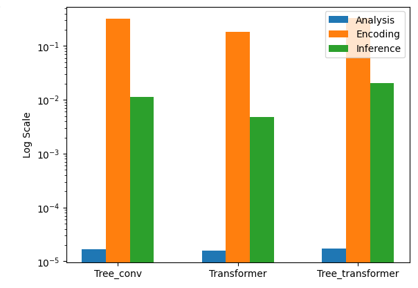
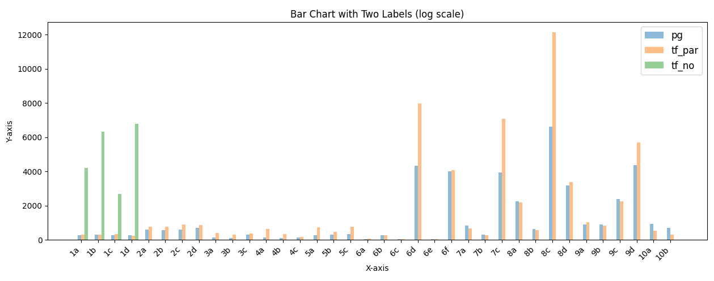
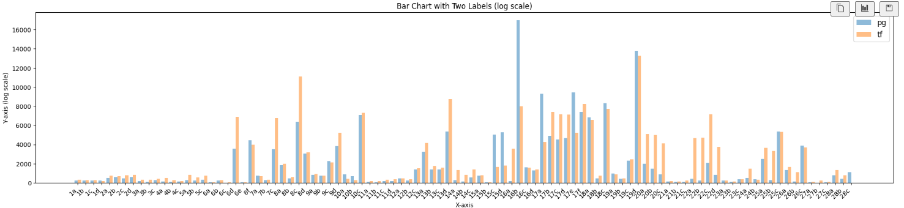
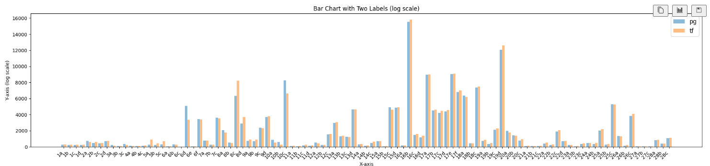
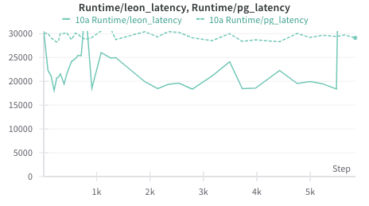
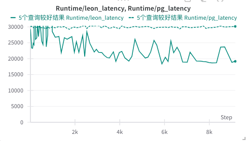
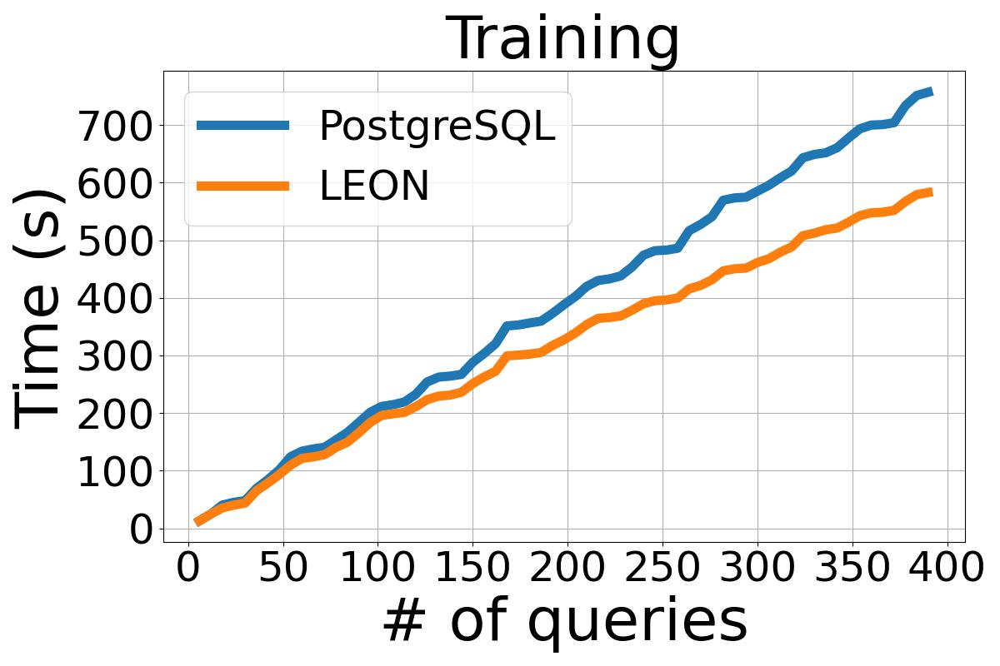
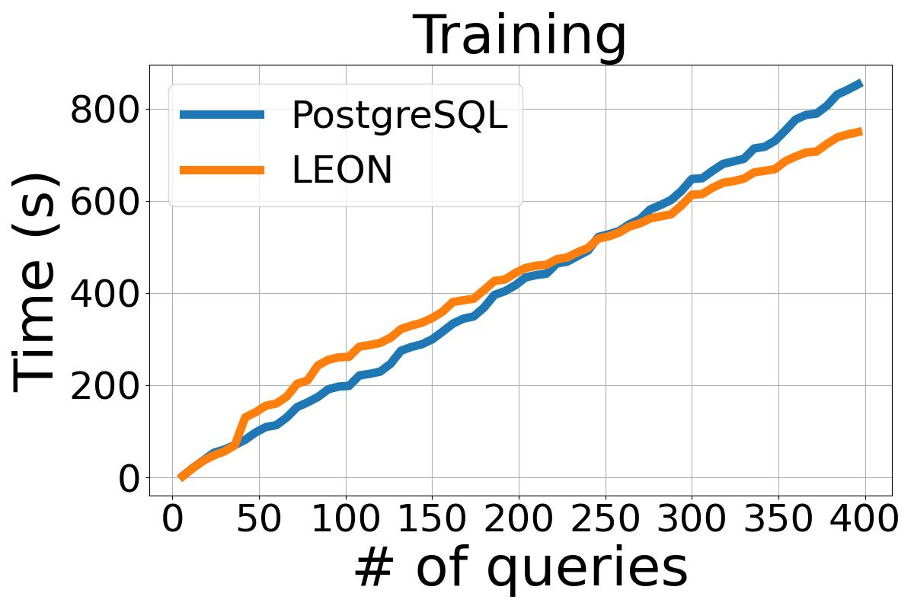

# LEON System Documentation

This document provides an overview of the LEON system, focusing on its training and inference components as implemented in `LEON_train.py` and `Leon_server.py`.

## Pre-requests
### GUC
Set following guc for enabling (enable_leon is off as default, not_cali is off as default)
```bash
enable_leon = on;
not_cali = off;
```
### Postgres Config
Load ./conf/LEON-postgresql.conf into postgresql

## LEON_train.py - Training Process
### TODO:
- [ ] write nodes file with ray
- [ ] pick_node
- [ ] train model


The training process is broken down into several steps, involving chunking queries, executing them, and using the feedback for training a model.


Queries are processed in batches for efficiency:

```python
chunks = chunk(Querylist, 5)

for chunk in chunks:
    for query in chunk:
        Feedback_1, Nodes = pg.execute(query, leon=on)  # Inference phase

    # Execution phase
    nodes_to_execute = Pick_node(Nodes)
    Feedback_2 = pg.execute(nodes_to_execute.to_sql(),
                            nodes_to_execute.to_hint(), 
                            leon=off) 
    experience = Exp(Feedback_1, Feedback_2)

    # Training phase
    experience.getpair()
    model.train()
```

## Leon_server.py - Inference Process
### TODO:
- [x] Fix json load errors (parsed from postgres)
- [x] Ingretation of transformer
- [x] Test inference efficiency and bottleneck

- [x] Test trained model ([SeqTransformer](https://github.com/liang-zibo/DACE))

    **pre-trained model for 10 templates**

    
    **pre-trained model for 30 templates (omit 28c)**

    23个优化分别是['1d', '6f', '7a', '9b', '9c', '10a', '10b', '12a', '15c', '15d', '16b', '16c', '17a', '17e', '18a', '18c', '19a', '19d', '23a', '23c', '24b', '25c', '26c'] 
    
    76个劣化pg

    
    **Warning: Query Regression on 28C**

    

    **End to End Runtime**

    |        | Runtime       |          |
    | :------: | :------: | ------: |
    ｜          | Postgres | SeqFormer |
    | with 28c      | 190.9s   | 26006.6s  |
    | without 28c   | 190.9s   | 233.7s    |

- [x] Multiple Database Execution for acceleration.
- [x] Add Eqset Judgement for model inference

    **End to End Runtime**

    25个结果优于pg，74个结果劣于pg

    优于pg的查询['2a', '3a', '3c', '4a', '6a', '6b', '6d', '6f', '7c', '8a', '8b', '9c', '10a', '10b', '10c', '12a', '13c', '15c', '16a', '18a', '18b', '20a', '20b', '25c', '26a']


   

    |        | Runtime       |        |
    | :------: | :------: | ------: |
    ｜          | Postgres | SeqFormer |
    |       | 181.7s   | 185.8s  |


- [x] Offline training 

        5 Queries

    

    

    **问题1**：等价类打分方式：目前按照优化时间的大小排序，并且只更新那些出现在最终执行计划中的等价类（*我们认为真正有效的plan*），讨论过那些*没出现在最终计划中的plan*影响较小，所以可以被删除。
    
    目前，我们给每个等价类的有效程度做了排序按照最大值排序（现在已经改为query平均），最终执行计划有的才更新。考虑把*QueryId*加入经验池。*目前QueryID直接用的查询文件名*
    
    **问题2**：如果新添加进来的等价类下次执行计划中没有，删的方式：目前是不pick node后，直接删
    可能改为分值是0 就就只picknode，不训练

    **问题3**：leon timeout explain (突然出现裂化的情况，在某个已经训练的且稳定表现的等价类中，突然选择了另一个plan，这个可以参考PerGuard的做法，有可能解决)
    
    **问题4 [效果不好]**：等价类数量增加15 to 25增加为20 to 30 

- [ ] 改变训练方法: 从原来get pair后训练，变成get pair前训练，或者优先经验回放（回放新增加数据，排名较高数据）

    **问题5**：如果新添加的等价类没效果（不在完整计划里），就直接删掉 [采用]

    **问题6**：现在用更保守的方式拿等价类，当一个query优化足够好（0.75）后，不再增加删除等价类（这个规则可以保留或删除），让模型陷入局部最优


    
- [x] Online Training 

    Tree Conv Model and Pretrain
    
    

    Tree Conv Model and Without Pretrain

    

    Tree Conv Model and No Pretrain on Job Training Workload

    
